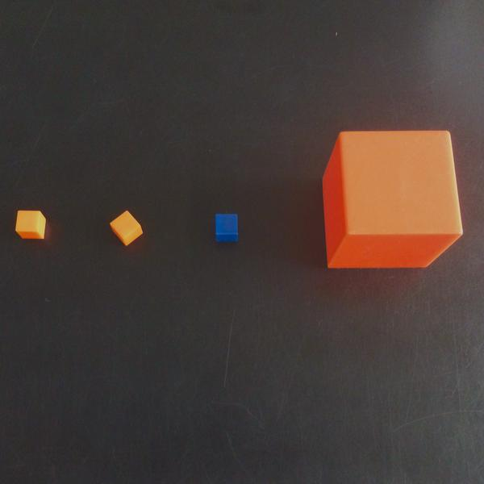

= Introduction to Dilations

*Students explore dilations and learn a new function that enables them to create enlargements and reductions of images.*

[.left-header,cols="20a,80a", stripes=none]
|===
|Lesson Goals
|Students will be able to:

* Explain 'center' and 'scale factor' as related to dilations
* Demonstrate understanding that dilations change measurements of a figure proportionally

|Student-Facing Lesson Goals
|
* I can describe what a dilation is using words or actions.
* I can determine, given the scale factor, if the dilation will be larger or smaller than the original image.
* I can figure out the dimensions of a shape after a dilation.

|Key Points for the Facilitator
|
* Students should discover independently that a scale factor of <1 creates a smaller image (reduction) and a scale factor of >1 creates a larger image (enlargement).
* Students should connect the scale factor to previous knowledge of percentages.
* The scale function in WeScheme will not allow for negative scale factors.  Negative scale factors are covered in Dilations on the Coordinate Plane.

|Prerequisites
|
* Students should be familiar with Circles of Evaluation.

|Materials
|
* Links to printables, activities, etc., go here
|===

[.left-header,cols="20a,80a", stripes=none]
|===
|Math Standards (CCSS)
|
* http://www.corestandards.org/Math/Content/8/G/A/[CCSS.8.G.A], Understand congruence and similarity using physical models, transparencies, or geometry software.

* http://www.corestandards.org/Math/Practice/MP2[CCSS.MATH.PRACTICE.MP2],
Reason abstractly and quantitatively.

|CS Standards (CSTA)
|
* CS Standards here.
|===

== Get Ready:

Students should have their computer, contracts page, and pencil.

== Launch: (10 min)

Which One Doesn't Belong?

Give students 20-30 seconds to look at the image and decide which one they think does not belong, then move into groups according to the item they chose.

Give students 1-2 minutes to discuss their choice as a group before moving into group discussion and debate.  

To wrap up the discussion, emphasize that all the figures are cubes that have had some element altered, whether it's the position on the table, the angle it's sitting at, its color, or its size. 

[.strategy-box]
.Strategies for English Language Learners
****
MLR 5 -- Co-Craft Questions and Problems: Give students time to think and discuss with a partner or a small group before large group discussion.  Encourage students to build off each other's responses and move towards mathematical language.
**** 

== Explore: (time here)

Have students open the Scaling Exploration teachpack and investigate with their partner.  

== Discuss: (time here)

* What new tools did you discover in this activity? _(bitmap/url, scale, image-)_
* What do you think the contract for bitmap/url is? _(bitmap/url: String -> Image)_  
* What do the different parts represent? _(The String is a URL, or web address, and the Image is the picture found at that URL)_
* What do you think is the contract for scale? _(scale: Number Image -> Image)_
* What does the Number appear to mean? _(The scale factor, how much bigger or smaller the new image will be)_
* What do you notice about the scale factor?  _(We can use either decimals or fractions, a scale factor of less than one makes the image smaller and greater than one makes the image larger, negative numbers don't work, etc)_

== Practice: (time here)

3-4 sentences of prose + images describing task.

== Create/Apply: (15 minutes)

Students search for images on the Internet and bring them into WeScheme using bitmap/url.  

